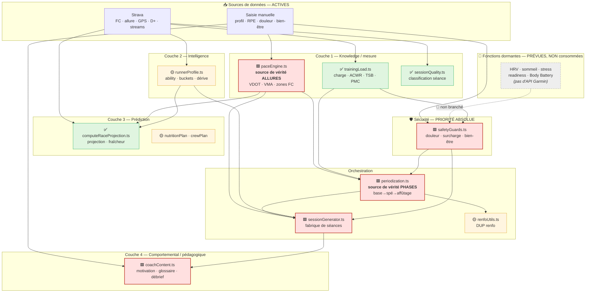
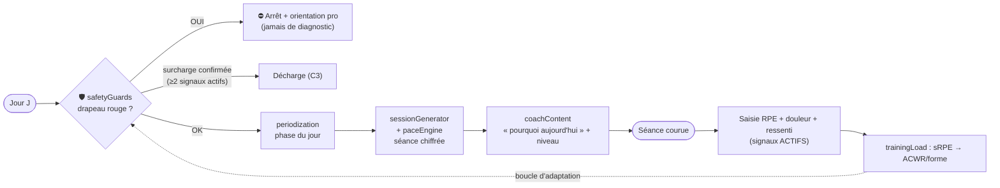

# Coach Vorcelab — Schéma d'architecture du moteur

> Vue d'ensemble des modules, des **sources de vérité**, des flux de données et de **l'ordre d'évaluation**.
> Principe directeur : moteur **déterministe** (aucune IA), pures fonctions `src/lib`, **aucune dépendance aux signaux appareil** (cf. fonctions dormantes). Daté 2026-05-30.

> 🔄 **Consolidation (2026-05-31)** : le moteur s'appuie désormais sur l'engine existant **`src/lib/coach/`** (`workouts.ts` = catalogue source de vérité des séances, `planGenerator.ts` = phases/plan, source de vérité de la périodisation). Les modules redondants `periodization.ts` et `sessionCatalog.ts` ont été **retirés**. Mes apports uniques restent et se branchent dessus : `paceEngine` (allures), `structureWorkout` (template → blocs chiffrés), `sessionRecommender` (badges choix-first sur `WORKOUTS`), `safetyGuards`, `coachContent`.

---

## 1. Carte des modules par couche

**Légende** : 🟥 nouveau module (épopées A-E) · ✅ bâti · 🟡 partiel · 🌙 dormant.

---

## 2. Ordre d'évaluation du moteur (un cycle de prescription)

**Règle d'or** : `safetyGuards` s'évalue **avant** toute logique de performance. La boucle de feedback se nourrit **uniquement** de signaux actifs (Strava + auto-déclarés).

---

## 3. Sources de vérité (anti-duplication)

| Donnée | Source de vérité unique | Qui consomme |
|---|---|---|
| **Allures & zones** | `paceEngine.ts` | sessionGenerator, periodization, computeRaceProjection |
| **Phases & deload** | `periodization.ts` (`getCurrentPhase()`) | sessionGenerator, **renfoUtils** (remplace son `Date.now() % 4`) |
| **Charge / ACWR / forme** | `trainingLoad.ts` | safetyGuards, periodization |
| **Profil de terrain** | `runnerProfile.ts` | sessionGenerator (côtes), computeRaceProjection |

> Risque historique résolu par ce schéma : deux périodisations concurrentes (`renfoUtils` autonome vs plan course). `periodization.ts` devient l'unique horloge de phases.

---

## 4. Invariant — fonctions dormantes

Les signaux **appareil** (HRV, sommeil, stress, readiness, Body Battery) sont **modélisés** dans l'archi (interface `ReadinessSignal { source: 'manual' | 'device' }`, feature-flag `DEVICE_SIGNALS_ENABLED = false`) mais **jamais consommés** par le moteur tant qu'aucune API (Garmin ou autre) ne les fournit. Le jour où la source existe, on bascule le flag **sans réécrire** le moteur.
